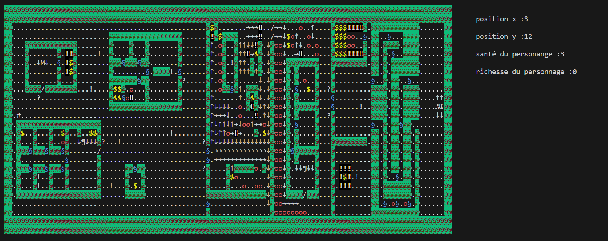

# LES ÉPREUVES DU SPHINX : UNE AVENTURE ÉNIGMATIQUE

Bienvenue dans "Les Épreuves du Sphinx", une aventure énigmatique où vous devrez faire face à des défis, résoudre des énigmes et explorer un monde mystérieux.

## Règles du Jeu

### Caractères et Significations

**Case Vide, Traversable (0)**
  - Une case vide que le joueur peut traverser.

**Mur (1)**
  - Un mur infranchissable.

**Porte Fermée (2)**
  - Une porte fermée qui bloque le passage. Le joueur doit répondre à une question pour l'ouvrir.

**Porte Ouverte, Traversable (3)**
  - Une porte ouverte que le joueur peut traverser.

**Barrière Gauche (4)**
  - Une barrière à gauche qui ne peut être traversée que dans un sens.

**Barrière Droite (5)**
  - Une barrière à droite qui ne peut être traversée que dans un sens.

**Barrière Bas (6)**
  - Une barrière en bas qui ne peut être traversée que dans un sens.

**Barrière Haut (7)**
  - Une barrière en haut qui ne peut être traversée que dans un sens.

**Trésors, Traversable (8)**
  - Un trésor que le joueur peut traverser. En le traversant, le trésor disparaît et est remplacé par une case vide. Le joueur gagne de la richesse échangeable chez un marchand.

**Marchand (9)**
  - Un marchand qui ne peut pas être traversé. Si le joueur tente de le traverser, une boîte de dialogue s'ouvre avec des options d'achat (échange de richesses contre des bonus).

**Aubergiste (10)**
  - Un aubergiste qui ne peut pas être traversé. Permet au joueur de se reposer et de regagner des points de vie.

**Personne (11)**
  - Une personne qui ne peut pas être traversée. Si le joueur tente de la traverser, une boîte de dialogue s'ouvre avec des informations ou des énigmes.

**Panneau (12)**
  - Un panneau qui ne peut pas être traversé. Si le joueur tente de le traverser, une boîte de dialogue s'ouvre et fournit des informations.

**Le Sphinx (13)**
  - Le Sphinx qui ne peut pas être traversé. Si le joueur tente de le traverser, les énigmes du Sphinx commencent.

**Piège, Traversable (14)**
  - Un piège que le joueur peut traverser. En le traversant, le joueur perd un point de vie, puis le piège est remplacé par une case vide.

**Piège Mortel !, Traversable (15)**
  - Un piège mortel que le joueur peut traverser. Si le joueur le traverse, il meurt, et la partie est finie.

**Entrée de Grotte/Donjon, Traversable (16)**
  - Une entrée de grotte ou de donjon que le joueur peut traverser. En le traversant, le joueur termine le jeu.

## Comment Jouer

1. **Déplacement**
   - Utilisez les touches directionnelles pour déplacer le personnage.

2. **Interaction avec les Éléments**
   - Approchez-vous des portes, trésors, marchands... pour interagir avec eux.

3. **Résolution d'Énigmes**
   - Soyez prêt à répondre aux énigmes du Sphinx et à relever les défis qui se présentent.

4. **Objectif**
   - Explorez le monde, résolvez les énigmes, et atteignez l'entrée de la grotte/donjon.

Que l'aventure commence ! 🗝🔍✨